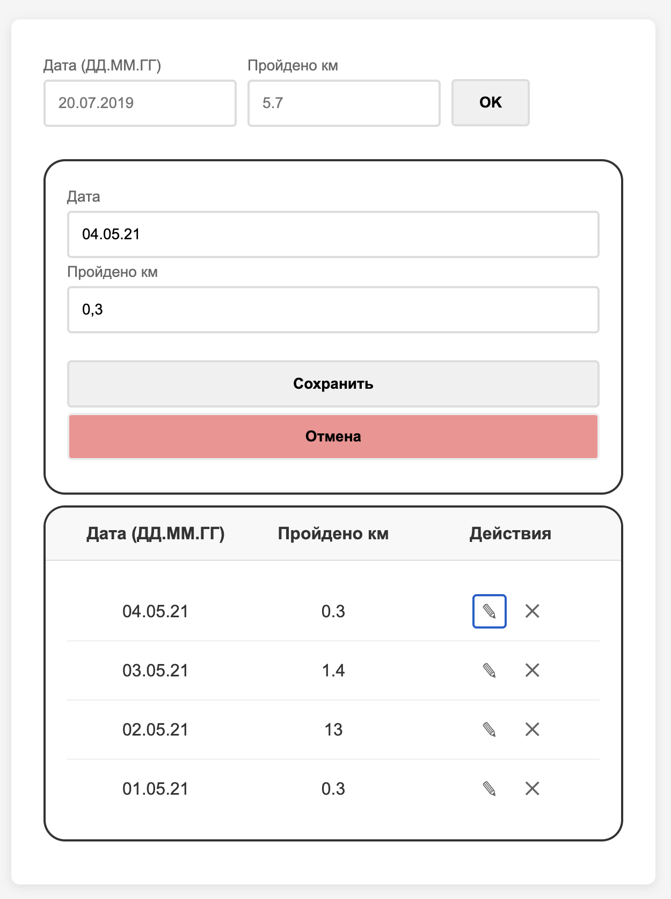

# Задание 9.2 Менеджер тренировок

## Описание 

Программа для сохранения данных о тренировках. Данные не теряются после обновления. Данные сохраняются в локальном хранилище.

Также программа позволяет редактировать и удалять данные. Создано модальное окно с функцией редактирования

__Функции__

- `filteredRecords` - функция сначала суммирует одинаковые даты, затем их фильтрует от самого нового к старому
- `handleSaveEdit` - функция сохраняет данные в хранилище
- `handleDelete` - функция удаляет данные из хранилища
- `openEditModal` - функция открывает модальное окно для редактирования данных
- `closeEditModal` - функция открывает модальное окно для удаления данных 

Все данные обновляются при изменении зависимости `records` 

## Зависимости 

Приложение использует библиотеку [uuid](https://www.npmjs.com/package/uuid) для генерации уникальных идентификаторов. Которые в последующем используются для хранения в `localStorage`

## Формат хранения

``` 
0
: 
{id: "b2619ec3-6983-4262-b6de-855ba35ed213", date: "02.05.21", distance: 13}
1
: 
{id: "d935f0cc-46a5-4ad3-bfe1-0d1a0de5e10b", date: "03.05.21", distance: 1.4}
```

## Пример интерфейса программы



## Код программы и структура проекта

Программа находится в папке `src`.

Структура проекта 
```
AdvancedJS_T9_ColorConvertor/
├── public/ 
├── node_modules/
├── assets/ // скрины
├── src/
│   ├── components/
│   │   ├── EditModal/
│   │   │   └── EditModal.tsx // модальное окно редактирования
│   │   ├── TableInfo/
│   │   │   └── TableInfo.tsx // таблица с данными
│   │   ├── AddForm/
│   │   │   └──AddForm.tsx // форма добавления данных
│   │   └── TrainingEditorComponent.tsx/ // компонент приложения
│   │       цветов
│   ├── model/
│   │   └── ITraining.ts // интерфейс данных
│   ├── App.jsx // компонент приложения
│   ├── App.css // общий стиль для всего приложения
│   |── index.css // корневые стили для проекта 
│   └── main.jsx // главный компонент приложения
├── index.html
├── .gitignore 
├── package.json
└── vite.config.js
```

## Запуск программы

- Сборка программы: `npm run build`
- Установка зависимостей: `npm install`
- Запуск программы: `npm run dev`
- Привью программы: `npm run preview`

